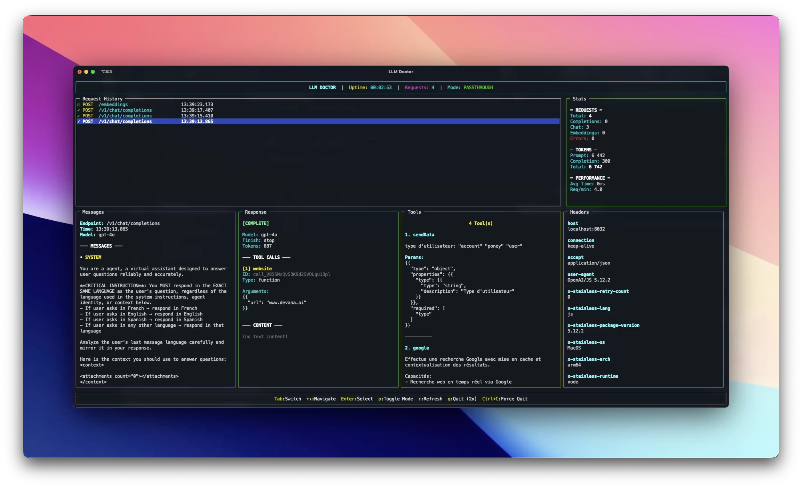

<div align="center">

# 🏥 LLM Doctor

### Professional API Monitoring & Error Simulation Tool for LLM Development

[](https://creativecommons.org/licenses/by-nc-sa/4.0/)
[](https://www.typescriptlang.org/)
[](https://nodejs.org/)

**The ultimate development companion for building reliable LLM applications**



_Real-time monitoring, error simulation, and seamless API inspection in action_

[Features](#-features) • [Installation](#-installation) • [Usage](#-usage) • [Architecture](#-architecture)

</div>

---

## 🎯 What is LLM Doctor?

LLM Doctor is a sophisticated monitoring and testing tool designed for developers building applications with Large Language Model APIs. It provides a complete OpenAI-compatible server with real-time monitoring, error simulation, and passthrough capabilities.

### Why LLM Doctor?

- **🔍 Debug with Confidence**: See exactly what your app sends and receives
- **💥 Test Error Handling**: Simulate realistic API errors before they hit production
- **📊 Performance Insights**: Track tokens, timing, and throughput in real-time
- **🔄 Seamless Integration**: Drop-in replacement for OpenAI API endpoints
- **🎨 Beautiful TUI**: Professional terminal interface for monitoring

---

## ✨ Features

### 🎭 Error Simulation

Simulate real-world LLM API errors to test your application's resilience:

- **Safety Content Filter** (Microsoft/Azure style)
- **Rate Limit Exceeded** (429 errors)
- **Model Overloaded** (503 errors)
- **Request Timeout** (504 errors)
- **Context Length Exceeded** (token limit errors)
- **Invalid Request** (400 validation errors)
- **Authentication Errors** (401 errors)

Access via keyboard shortcut `m` for instant error injection.

### 📡 Real-Time Monitoring

Professional terminal UI with 5 specialized panels:

1. **📝 Request History** - All API calls with status indicators
2. **💬 Messages** - Request payloads with expandable messages
3. **🤖 Response** - Complete response content and metadata
4. **🔧 Tools** - Full tool definitions (non-truncated JSON!)
5. **📋 Headers** - HTTP headers for debugging

### 🔄 Passthrough Mode

Toggle between fake responses and real OpenAI API:

- Instant switching with `p` key
- Perfect for integration testing
- Preserves all monitoring capabilities

### 📊 Advanced Analytics

- Token counting (prompt, completion, total)
- Request/response timing
- Requests per minute
- Success/error rates
- Live performance metrics

### 🎯 OpenAI Compatible

Full support for:

- ✅ Chat Completions (`/v1/chat/completions`)
- ✅ Text Completions (`/v1/completions`)
- ✅ Embeddings (`/v1/embeddings`)
- ✅ Streaming responses (SSE)
- ✅ Tool/Function calling
- ✅ Models listing (`/v1/models`)

---

## 🚀 Installation

### Quick Start with npx (Recommended)

No installation required! Run directly with npx:

```bash
# Start with default settings
npx llm-doctor

# With custom port
npx llm-doctor --port 3000

# With OpenAI API key for passthrough mode
npx llm-doctor --api-key sk-...

# All options
npx llm-doctor --port 8080 --host localhost --api-key sk-...
```

### Install Globally

```bash
npm install -g llm-doctor

# Then run anywhere
llm-doctor
llm-doctor --port 3000
```

### Local Development

```bash
# Clone the repository
git clone https://github.com/Scriptor-Group/llm-doctor.git
cd llm-doctor

# Install dependencies
npm install

# Start the server
npm start

# Or with development mode (auto-reload)
npm run dev
```

### CLI Options

```bash
llm-doctor [options]

Options:
  -p, --port <port>       Port to listen on (default: 8032)
  -h, --host <host>       Host to bind to (default: 0.0.0.0)
  -k, --api-key <key>     OpenAI API key for passthrough mode
  --help                  Show help message

Examples:
  llm-doctor
  llm-doctor --port 3000
  llm-doctor --api-key sk-...
  npx llm-doctor --port 8080 --api-key sk-...
```

The server will start on `http://localhost:8032` by default

---

## 💻 Usage

### Basic Setup

Point your LLM application to LLM Doctor instead of OpenAI:

```javascript
// Before
const openai = new OpenAI({
  baseURL: "https://api.openai.com/v1",
});

// After - with LLM Doctor
const openai = new OpenAI({
  baseURL: "http://localhost:8000/v1",
});
```

### Keyboard Controls

| Key       | Action                                    |
| --------- | ----------------------------------------- |
| `Tab`     | Switch between panels                     |
| `↑` / `↓` | Navigate requests/scroll content          |
| `Enter`   | Select request to view details            |
| `Space`   | Toggle message expansion                  |
| `m`       | **Open error simulation menu**            |
| `k`       | **Set OpenAI API key** (in-app)           |
| `p`       | Toggle passthrough mode (Fake ↔ Real API) |
| `f`       | Fullscreen current panel                  |
| `Esc`     | Exit fullscreen                           |
| `r`       | Refresh display                           |
| `q`       | Quit (press twice)                        |
| `Ctrl+C`  | Force quit                                |

### Error Simulation

1. Press `m` to open the error menu
2. Select the error type you want to simulate
3. Make API requests - they'll return the simulated error
4. Select "None" to disable error simulation

Perfect for testing:

- Retry logic
- Error handling
- User-facing error messages
- Graceful degradation
- Circuit breakers

### Passthrough Mode

Enable real OpenAI API forwarding in three ways:

**1. CLI argument (recommended for testing):**

```bash
npx llm-doctor --api-key sk-...
```

**2. In-app (recommended for security):**

- Press `k` in the UI
- Enter your API key (hidden with \*)
- Key stored in memory only, never saved to disk

**3. Environment variable:**

```bash
# Create .env file
echo "OPENAI_API_KEY=sk-..." > .env

# Start server
npm start
```

Press `p` in the UI to toggle passthrough mode on/off. All requests are forwarded to real OpenAI API while maintaining full monitoring!

## 📊 Use Cases

### 🧪 Integration Testing

Test your LLM application against various API responses without burning tokens:

```typescript
// Your test suite
describe("LLM Error Handling", () => {
  it("handles rate limits gracefully", async () => {
    // Manually trigger rate limit in LLM Doctor (press 'm', select 'Rate Limit')
    const response = await callYourLLMFunction();
    expect(response.error).toBeDefined();
    expect(response.retryAfter).toBe(60);
  });
});
```

### 🔍 Debugging

- Inspect exact request/response payloads
- Verify token counts match expectations
- Check tool calling parameters
- Debug streaming issues

### 📈 Performance Testing

- Monitor requests per minute under load
- Track average response times
- Measure token consumption
- Identify bottlenecks

### 🎓 Learning

- Understand OpenAI API structure
- Learn about different error types
- Experiment with parameters safely
- Study streaming protocols

---

## 🤝 Contributing

Contributions are welcome! This is an open-source project under a non-commercial license.

### Guidelines

1. Fork the repository
2. Create a feature branch
3. Follow existing code style (TypeScript strict mode)
4. Maintain separation of concerns
5. Add types for all new code
6. Test your changes
7. Submit a pull request

---

## 📄 License

This project is licensed under the **Creative Commons Attribution-NonCommercial-ShareAlike 4.0 International License**.

**You are free to:**

- ✅ Use for personal projects
- ✅ Use for educational purposes
- ✅ Modify and adapt the code
- ✅ Share with others

**Under the following terms:**

- 📝 **Attribution** - Give appropriate credit
- 🚫 **NonCommercial** - Not for commercial use
- 🔄 **ShareAlike** - Share adaptations under the same license

For commercial licensing, please contact the author.

See [LICENSE](LICENSE) for full details.

---

## 🙏 Acknowledgments

Built with:

- [Express](https://expressjs.com/) - Web framework
- [Blessed](https://github.com/chjj/blessed) - Terminal UI
- [TypeScript](https://www.typescriptlang.org/) - Type safety

Inspired by the need for better LLM development tools.

---

<div align="center">

**Développé avec ❤️ par les équipes de [Devana](https://devana.ai)**

_Made with ❤️ for the LLM developer community_

⭐ Star this repo if you find it useful!

</div>
